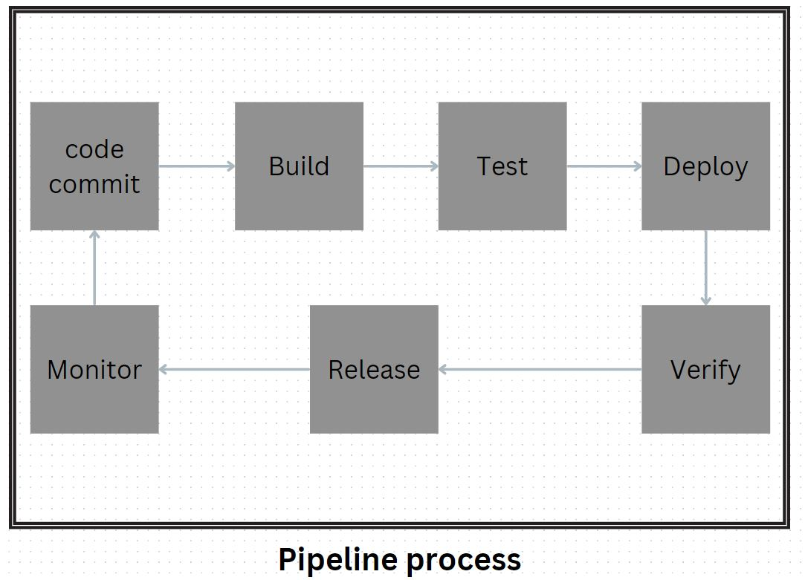

# The pipeline process typically includes the following steps:

### Code Commit:

Developers commit their code changes to a version control system, such as Git.

### Build:

The code is built into an executable or deployable artifact. This may involve compiling code, packaging dependencies, and creating a deployable package.

### Test:

Automated tests are run to ensure that the code changes work as expected and do not introduce any regressions. This includes unit tests, integration tests, and other types of tests depending on the application.

### Deploy:

The built artifact is deployed to a staging or production environment. This may involve deploying to a cloud platform, a server, or a containerized environment.

### Verify:

Additional tests and checks are performed in the staging or production environment to ensure that the deployment was successful and the application is functioning correctly.

### Release:

If all tests and checks pass, the new code changes are released to users or made available for further testing.

### Monitor:

The application is continuously monitored in the production environment to detect any issues or performance problems. This may involve logging, error tracking, and performance monitoring.

### Iterate:

The process is repeated for each new code change, allowing for continuous integration and deployment.
